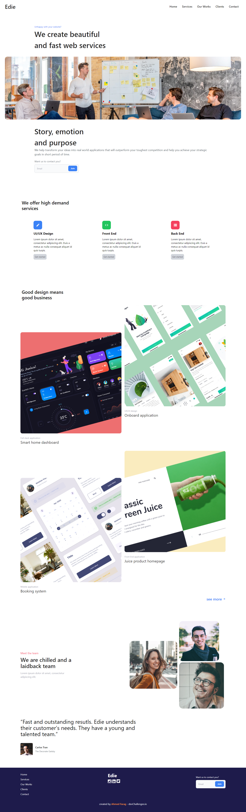

<!-- Please update value in the {}  -->

<h1 align="center">Edie homepage</h1>

   Solution for a challenge from  <a href="http://devchallenges.io" target="_blank">Devchallenges.io</a>.

  <h3>
    <a href="https://ahmedfarag18.github.io/Edie-homepage/">
      Demo
    </a>
     | 
    <a href="https://github.com/AhmedFarag18/Edie-homepage">
      Solution
    </a>
     | 
     <a href="https://devchallenges.io/challenges/xobQBuf8zWWmiYMIAZe0">
      Challenge
    </a>
  </h3>

<!-- TABLE OF CONTENTS -->

## Table of Contents

- [Overview](#overview)
  - [Built With](#built-with)
- [Contact](#contact)

<!-- OVERVIEW -->

## Overview

### Built With

- HTML
- Css

## Contact

- Website [portfolio](http://portfolio-blue-phi.vercel.app/)
- GitHub [@AhmedFarag18](https://github.com/AhmedFarag18)
- Linkedin [@ahmedfarag18](https://www.linkedin.com/in/ahmedfarag18/)
